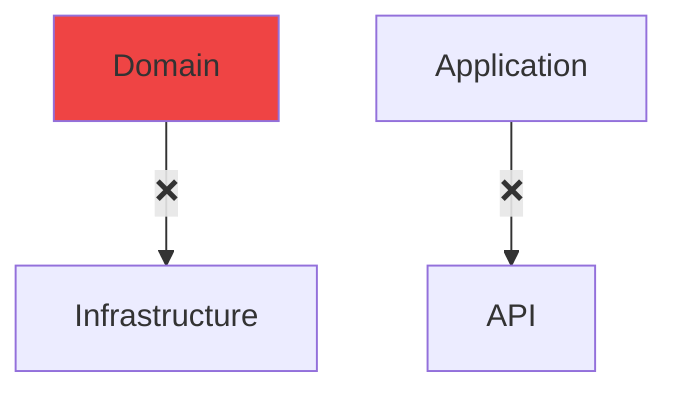

# Clean Architecture

<div class="pt-12">
  <span @click="$slidev.nav.next" class="px-2 py-1 rounded cursor-pointer hover:bg-white hover:bg-opacity-10">
    Comenzar <carbon:arrow-right class="inline"/>
  </span>
</div>

---
layout: center
class: text-center
---

# ¿Qué es Clean Architecture?

<v-clicks>

- El **núcleo de la aplicación** (lógica de negocio) está en el **centro**  
- **No depende** de detalles externos (bases de datos, frameworks, servicios)  
- Los **detalles externos dependen del núcleo**  
- Se logra mediante **abstracciones e interfaces**

</v-clicks>

<div v-click class="mt-8 flex justify-center">
  
</div>


---
layout: two-cols
---

# Estructura por Capas 


- La **API** accede al **núcleo del negocio** mediante interfaces.
    
- La infraestructura implementa estas interfaces y trabaja con **entidades de Core**.
    
- La API nunca llama directamente a la infraestructura: esto se llama **inversión de control**, y se logra con inyección de dependencias.

---
layout: default
---

# Estructura de Proyectos 

<div class="grid grid-cols-2 gap-4 mt-8">

<div v-click>

### Capas Principales

<div class="grid grid-cols-2 gap-x-6 gap-y-8 justify-items-center mt-8">
  <div class="flex flex-col items-center">
    
    <p class="text-sm mt-2 font-bold text-center">API/Presentación</p>
  </div>
  <div class="flex flex-col items-center">
    
    <p class="text-sm mt-2 font-bold text-center">Dominio</p>
  </div>
  <div class="flex flex-col items-center">
    
    <p class="text-sm mt-2 font-bold text-center">Aplicación</p>
  </div>
  <div class="flex flex-col items-center">
    
    <p class="text-sm mt-2 font-bold text-center">Infraestructura</p>
  </div>
</div>

</div>

<div v-click>
Estructura de Carpetas

```text
BaseCleanArchitecture
│
├── src
│   ├── BaseCleanArchitecture.API
│   │   ├── Controllers
│   │   ├── Middlewares
│   │   └── Extensions
│   ├── BaseCleanArchitecture.Application
│   │   ├── Commands
│   │   ├── Queries
│   │   ├── DTOs
│   │   ├── Validators
│   │   └── Mappings
│   ├── BaseCleanArchitecture.Domain
│   │   ├── Entities
│   │   └── Interfaces
│   └── BaseCleanArchitecture.Infrastructure
│       ├── Persistence
│       ├── Repositories
│       └── Services
└── tests
    └── BaseCleanArchitecture.UnitTests
        ├── CommandsTests
        ├── QueriesTests
        └── ValidatorsTests
```

</div>

</div>

---
layout: default
---

# Nomenclatura de Proyectos 

<v-clicks>

## Patrón: `Empresa.Negocio.Capa`

</v-clicks>

<div v-click class="mt-8">

| Capa | Nombre del Proyecto |
|------|---------------------|
| API / UI | `Target.Booking.App` |
| Domain | `Target.Booking.Domain` |
| Application | `Target.Booking.Application` |
| Persistencia | `Target.Booking.Persistence` |
| Servicios Externos | `Target.Booking.External` |
| Compartido | `Target.Booking.Common` |

</div>

<div v-click class="mt-6 p-4 bg-blue-500 bg-opacity-20 rounded">
💡 <strong>Ventaja:</strong> Identificación inmediata de empresa, negocio y capa
</div>

---
layout: center
---

# Regla de Dependencia 🔑

<div class="text-2xl font-bold text-center mb-8" v-click>
Las dependencias SIEMPRE apuntan hacia adentro
</div>

<div class="grid grid-cols-2 gap-8">

<div v-click>

### ✅ Correcto


</div>

<div v-click>

### ❌ Incorrecto



</div>

</div>

<div v-click class="mt-8 text-center">
**Domain** no conoce Application ni Infrastructure  
**Application** no conoce Infrastructure ni API
</div>

---
layout: two-cols
---

# Ventajas 

<v-clicks>

- ✨ **Separación clara** de responsabilidades
- 🔧 **Mantenible** y escalable
- 🧪 **Testeo sencillo** sin dependencias
- 🎯 **Independiente** de frameworks
- 👥 **Código entendible** para nuevos devs
- 🚀 Ideal para **proyectos grandes**

</v-clicks>

::right::

# Desventajas 

<v-clicks>

- ⚠️ **Mayor complejidad** inicial
- ⏰ Más tiempo de **configuración**
- 📚 **Curva de aprendizaje**
- 🔧 Posible **sobreingeniería** en proyectos pequeños

</v-clicks>

<div v-click class="mt-8 p-4 bg-yellow-500 bg-opacity-20 rounded">
<strong>Usa Clean Architecture si:</strong><br>
Tu proyecto es grande o de largo plazo
</div>

---
layout: default
---

# ¿Por Qué es bueno usar Clean Architecture? 

<div class="grid grid-cols-3 gap-6 mt-12">

<div v-click class="p-6 bg-blue-500 bg-opacity-20 rounded-lg">
<div class="text-4xl mb-4">🎯</div>
<h3>Orden y Claridad</h3>
<p class="text-sm mt-2">Cada capa tiene responsabilidades definidas</p>
</div>

<div v-click class="p-6 bg-green-500 bg-opacity-20 rounded-lg">
<div class="text-4xl mb-4">🔄</div>
<h3>Flexibilidad</h3>
<p class="text-sm mt-2">Cambia DB o frameworks sin romper el negocio</p>
</div>

<div v-click class="p-6 bg-purple-500 bg-opacity-20 rounded-lg">
<div class="text-4xl mb-4">🧪</div>
<h3>Pruebas Fáciles</h3>
<p class="text-sm mt-2">Lógica aislada = tests rápidos y confiables</p>
</div>

</div>

<div v-click class="mt-12 text-xl">
Sin Clean Architecture, cambiar la base de datos puede <span class="text-red-400 font-bold">romper toda tu aplicación</span>
</div>

---
layout: end
class: text-center
---

# ¡Gracias! 

<style>
.slidev-layout {
  @apply px-8 py-8;
}
</style>